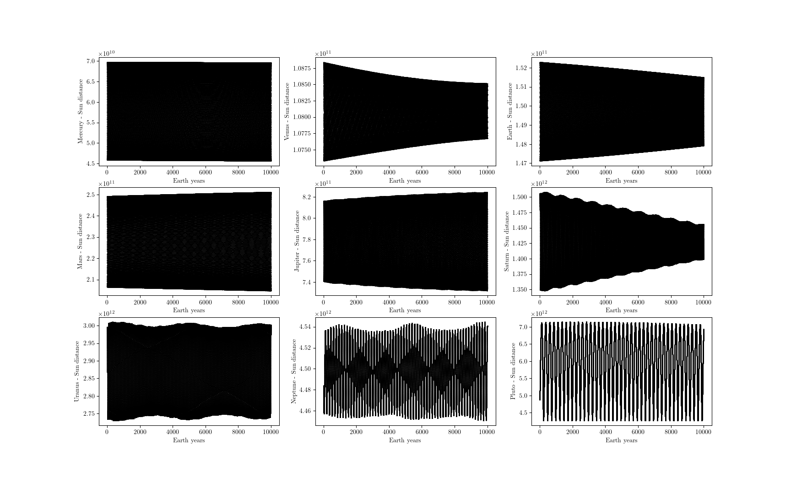
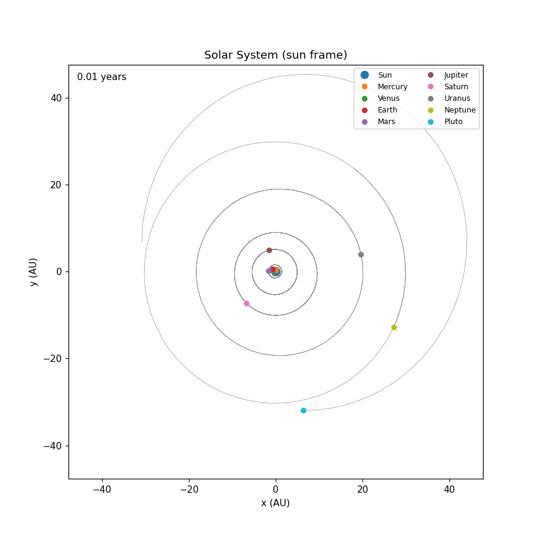
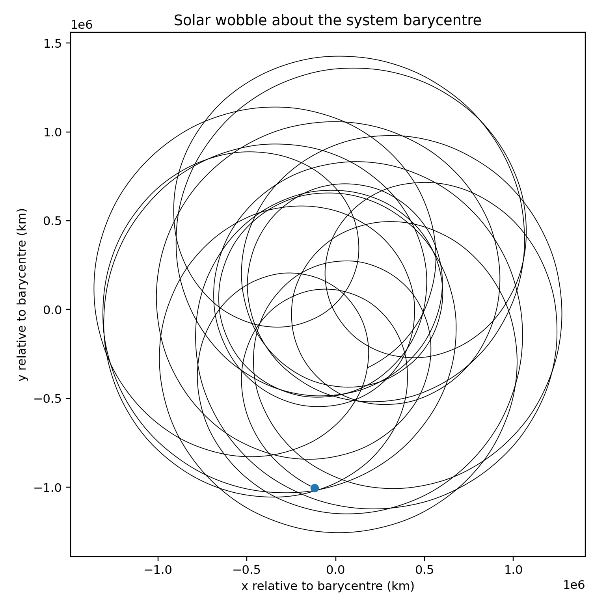

# Solar System Model (SSM)

The Solar System Model (SSM) is a Fortran model for integrating the 3-D
trajectories of ten Solar System bodies. It solves the Cartesian equations of
motion using Newtonian gravity and DVODE, with an optional approximate
relativistic correction referenced to the Sun.

The source code contains a longer Doxygen description of the governing
equations.

## Bodies

The model uses the following fixed ordering:

1. Sun
2. Mercury
3. Venus
4. Earth
5. Mars
6. Jupiter
7. Saturn
8. Uranus
9. Neptune
10. Pluto

## Requirements

- Fortran compiler (`gfortran` for the default Linux build)
- NetCDF Fortran
- the bundled `osnf/` numerical library

## Building

The normal build remains:

```bash
make
```

This retains the existing optimised heliocentric build.

Two optional convenience targets are also provided:

```bash
make release
make debug
```

The original `PLATFORM=LINUX` / `PLATFORM=WIN64` mechanism is retained.

### NetCDF configuration

Existing local configurations remain supported. For example:

```make
NETCDF_FOR=/path/to/netcdf-fortran
NETCDF_C=/path/to/netcdf-c
NETCDF_LIB=-lnetcdff
```

You may also continue to provide `NETCDFLIB` and `NETCDFMOD` directly.

If no legacy NetCDF paths are supplied on Linux, the Makefile tries:

```bash
nf-config --fflags
nf-config --flibs
```

The assembled flags can also be overridden directly with
`NETCDF_FFLAGS` and `NETCDF_FLIBS`.

## Running

Run directly with:

```bash
./main.exe namelist.in
```

or use the supplied helper script:

```bash
./run.sh
```

## Namelist

### `&initial_state`

The input units are:

| Variable | Units |
| --- | --- |
| `x`, `y`, `z` | km |
| `ux`, `uy`, `uz` | km s-1 |
| `gm` | km3 s-2 |

The defaults in `solar_system.f90` are now stored in these same units and are
converted to SI once after the namelist is read. This prevents default values
from being converted twice in a partially specified namelist.

### `&run_vars`

| Variable | Meaning |
| --- | --- |
| `outputfile01` | output NetCDF filename |
| `run_forward_in_time` | reverse the initial velocities when false |
| `general_relativity` | enable the existing approximate solar GR correction |
| `dt` | output interval in days; also DVODE maximum step |
| `tfinal` | integration duration in years |
| `interval_io` | interval between progress messages in years |
| `interact(1:10)` | bodies enabled as Newtonian gravity sources |

No new solver controls have been added to the namelist. The existing DVODE
configuration and tolerances remain in the source.

## Interaction mask

`interact(j)=.true.` means body `j` contributes to the Newtonian acceleration.

With only the Sun enabled, for example:

```fortran
interact(1:10)=.true.,.false.,.false.,.false.,.false.,
               .false.,.false.,.false.,.false.,.false.
```

all planets feel the Sun but do not gravitationally interact with one another.

A body with no active Newtonian gravity sources still evolves according to
its velocity (`dx/dt=v`) rather than being frozen.

## Relativistic correction

The original relativistic approximation has been retained. The implementation
now explicitly calculates the correction relative to body 1 (the Sun), rather
than relying on the first enabled entry in the interaction list.

The `general_relativity` switch remains independent of the Newtonian
`interact` mask.

## Time integration

The existing DVODE setup, work arrays, tolerances and `ISTATE` handling are
unchanged.

The only integration-loop change is that the next requested output time is
limited to the final time:

```fortran
tout=min(tt+dt,tfinal)
```

This prevents the final requested integration time from overshooting `tfinal`
when the run duration is not an exact multiple of `dt`.

## NetCDF output

The trajectory output remains single precision to keep file size down:

| Variable | Units |
| --- | --- |
| `time` | s |
| `pos` | m |
| `vel` | m s-1 |

The output also includes:

| Variable | Description |
| --- | --- |
| `gm` | gravitational parameter of each body |
| `gravity_source` | integer form of the `interact` mask |

Global metadata records the initial epoch, body ordering, namelist filename,
integration direction, relativistic switch, heliocentric build switch,
`dt`, `tfinal`, and `interval_io`.

The NetCDF file remains open during the integration. Buffered output is
written and `nf90_sync` is called when the buffer is flushed, avoiding repeated
open/close cycles.

## Notes on this update

This update is intentionally conservative. It does **not**:

- change DVODE behaviour or error handling;
- add solver tolerances to the namelist;
- change trajectory output to double precision;
- remove currently unused state or diagnostic variables;
- restructure the original scientific/Doxygen comments.

The changes are limited to the selected unit, final-time, source-free motion,
solar-GR reference, NetCDF-output/metadata, and build portability fixes.

## Example simulations and figures

The plotting workflow is designed around three useful cases:

1. **Sun only / Keplerian** — `interact(1)=.true.` and all other interaction
   entries false. Each planet follows the central solar potential without
   mutual planetary perturbations.
2. **All interactions, heliocentric** — all ten `interact` entries are true,
   while the historical/default `-Dheliocentric` build keeps the Sun at the
   origin. This is useful for seeing perturbations of the planet orbits.
3. **All interactions, non-heliocentric** — all interactions are true and the
   code is compiled without `-Dheliocentric`. The Sun is then allowed to move.
   Plotting this run relative to the system barycentre gives a direct view of
   the solar wobble.

The distinction in case 3 is important: an interactions-on run made with the
normal heliocentric executable cannot visibly show the Sun wobbling because
the compile-time heliocentric transformation explicitly fixes it at
`(0,0,0)`.

### Python plotting requirements

Install the small plotting environment with:

```bash
python3 -m pip install -r requirements-plotting.txt
```

The new plotting scripts do not require a LaTeX installation.

### Generate a case namelist

A Sun-only case:

```bash
python3 python/make_case.py namelist.in runs/keplerian/namelist.in \
    --mode keplerian \
    --output runs/keplerian/output.nc \
    --tfinal 200 \
    --dt 5
```

An all-interaction case:

```bash
python3 python/make_case.py namelist.in runs/interacting/namelist.in \
    --mode interacting \
    --output runs/interacting/output.nc \
    --tfinal 200 \
    --dt 5
```

These commands copy the existing initial conditions and only change the
selected run variables. The reference `namelist.in` is not edited.

### Run Keplerian and interacting cases

Build the historical/default heliocentric model:

```bash
make clean
make HELIOCENTRIC=1
```

Then run both cases:

```bash
./main.exe runs/keplerian/namelist.in
./main.exe runs/interacting/namelist.in
```

Generate static plots:

```bash
python3 python/plot_ssm.py runs/keplerian/output.nc \
    --outdir docs/figures --prefix keplerian --origin sun

python3 python/plot_ssm.py runs/interacting/output.nc \
    --outdir docs/figures --prefix interacting --origin sun
```

Compare the perturbed and Sun-only trajectories:

```bash
python3 python/compare_runs.py \
    runs/keplerian/output.nc \
    runs/interacting/output.nc \
    docs/figures/interaction_difference.png
```

### Animated GIFs

A full-system animation with a thin black line for each orbital path:

```bash
python3 python/animate_ssm.py \
    runs/interacting/output.nc \
    docs/figures/interacting_all.gif \
    --system all --origin sun --frames 100
```

For the inner planets, a shorter time range is much easier to see:

```bash
python3 python/animate_ssm.py \
    runs/interacting/output.nc \
    docs/figures/interacting_inner.gif \
    --system inner --origin sun --max-years 5 --frames 100
```

### Show the Sun's barycentric wobble

For this case the compile-time heliocentric transformation must be disabled:

```bash
make clean
make HELIOCENTRIC=0
```

Create and run an all-interaction case:

```bash
python3 python/make_case.py namelist.in runs/barycentric/namelist.in \
    --mode interacting \
    --output runs/barycentric/output.nc \
    --tfinal 200 \
    --dt 5

./main.exe runs/barycentric/namelist.in
```

The initial state is historically expressed relative to the Sun, so for a
clean wobble visualisation the plotting script recentres every frame on the
instantaneous system barycentre:

```bash
python3 python/plot_ssm.py runs/barycentric/output.nc \
    --outdir docs/figures --prefix barycentric --origin barycentre

python3 python/animate_ssm.py \
    runs/barycentric/output.nc \
    docs/figures/barycentric_wobble.gif \
    --system all --origin barycentre --frames 100
```

When finished, restore the normal build if desired:

```bash
make clean
make HELIOCENTRIC=1
```

### One-command README figure workflow

All of the above can be run with:

```bash
./python/make_readme_figures.sh
```

The defaults are a 200-year simulation, 5-day output interval, and 300-frame
GIFs. They can be changed without editing the script:

```bash
TFINAL_YEARS=500 DT_DAYS=2 FRAMES=200 \
    ./python/make_readme_figures.sh
```

Output is kept under:

```text
runs/
├── keplerian/
├── interacting/
└── barycentric/

docs/figures/
```

### Example long integration

The following figure shows the planet-Sun distance from a 10,000-year
simulation and illustrates the range of short- and long-period structure in
the integrations.




### Planetary motion with mutual interactions

```markdown

```

### Solar barycentric wobble



Trajectory of the Sun relative to the Solar System barycentre when mutual
planetary interactions are enabled and the model is run without the
heliocentric coordinate constraint.

## Plotting scripts

Scripts are deliberately argument-driven rather than tied to a fixed
`/tmp/output.nc` filename:

- `python/make_case.py` — generate Keplerian or all-interaction namelists.
- `python/plot_ssm.py` — orbit, distance-to-Sun, and solar-wobble figures.
- `python/animate_ssm.py` — animated GIFs with thin black orbital paths.
- `python/compare_runs.py` — compare all-interaction and Sun-only runs.
- `python/make_readme_figures.sh` — reproduce the complete README figure set.

Older plotting scripts can still be accessed as analysis and provide further in-depth analysis.
